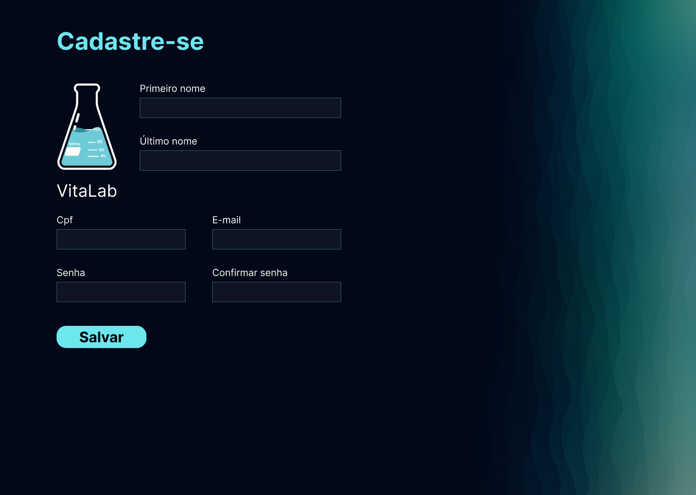
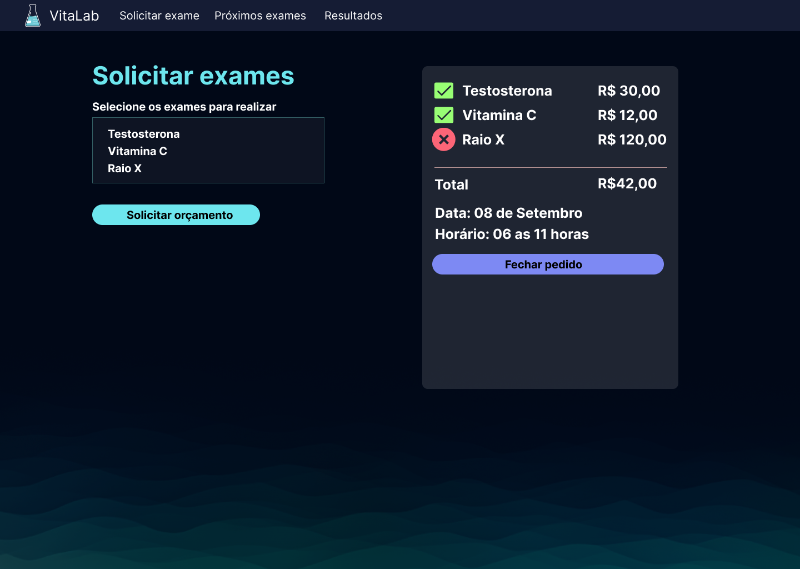

<h1 align="center"> Pythonando | PSW 8.0 </h1>

  
  

Desafio proposto no Evento Pythonando, para ensino de tecnologias WEB.

  

 

## 🚀 Tecnologias

Esse projeto foi desenvolvido com as seguintes tecnologias:

  <!--  -->
  
  
  
  
  
  

## 💻 Projeto

O projeto é uma aplicação de um laboratório com nome Vitalab para realização de exames.
[Mais detalhes do projeto aqui.](https://grizzly-amaranthus-f6a.notion.site/PSW-8-0-Aula-1-c5f28c09c09f4493ad20911f984e4fc8?pvs=4
)

<!-- ## PDF
[PDF](https://pythonando.com.br/media/recursos_aulas/PSW_8_0_Aula_1_c5f28c09c09f4493ad20911f984e4fc8.pdf) -->

## 🔖 Layout

Você pode visualizar o layout do projeto através [DESSE LINK](https://www.figma.com/file/FzqXqJXe5a8LWcq7LxISHN/Untitled?type=design&node-id=3-157&mode=design&t=kYSHqbNX3YVzPJgU-0). É necessário ter conta no [Figma](https://figma.com) para acessá-lo.

###  Resultado Aplicação 

 
 

<!-- 
 
<video width="219" height="454" controls="controls" autoplay="autoplay">
<source src="https://streamable.com/3pcted" type="video/mp4">
<object data="" width="219" height="240">
<embed width="320" height="454" src="https://streamable.com/3pcted">
</object>
</video>
-->

## Deploy do projeto

Confira [aqui em breve.]()
---

#### Url's:

http://127.0.0.1:8000/usuarios/cadastro/
 
http://127.0.0.1:8000/usuarios/login/
 
http://127.0.0.1:8000/exames/solicitar_exames/
 
http://127.0.0.1:8000/exames/gerenciar_pedidos/
<!-- ## Estrutura de pastas

-Vitalab
├── Exames
│  └── Migratios(e scripts)
├── Templates
│  └── bases
|      └── Arquivo base .Html 
|  └── static
|      └── exames
|      |    └── css
|      |    └── img
|      |     └── js
|      └── geral
|      |    └── css
|      |    └── img
|      └── usuarios
|          └── css
├── Usuários
|   └── templates
|      └── Arquivo.Html 
├── Vitalab
|   └── core da aplicação
└── fim -->

## :memo: Licença

Esse projeto está sob a licença MIT.

---

